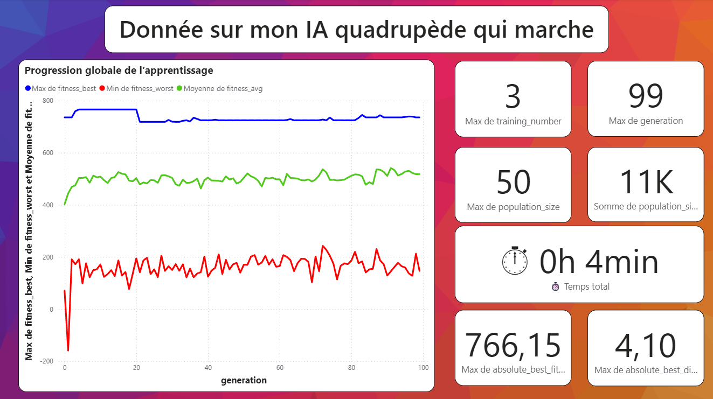
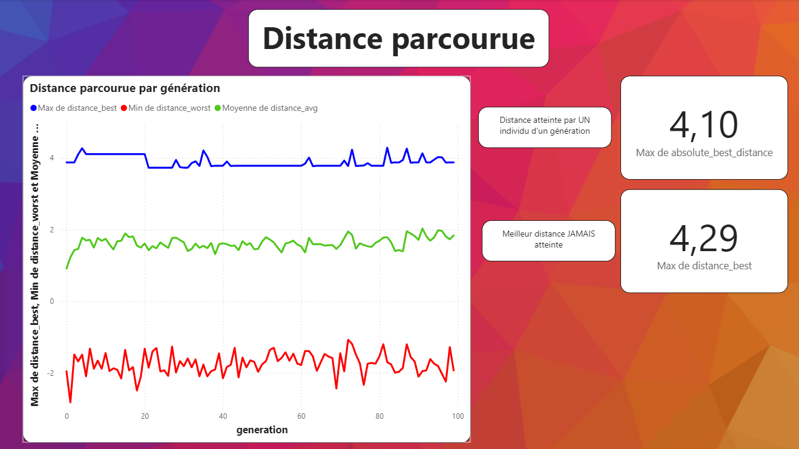

# Quadruped AI


  
  

<p align="center">
  
</p>


## 📝 Project Description 
This project is a try to understand how to use box2D with pygame. 🦊🦊🦊

To do so, I construct an AI able to control a quadruped, a fox with real physics, muscles, a world and a pretty low-poly design.

To learn data visualisation, I used Power BI to analyse in details !

🚨The project is not **finish** !🚨

---

## ⚙️ Features  

Constructed : 
- Real physique with muscles, interation with **box2D** library.
- A good-looking with pygame🦊.
- An algorithm to select the best choreography.

Project for the futur :
- A genetic algorithm
- PPO algorithm
- Add some commentary for each .py on the top for a better understanding of my code for AI (and me 🫠)


## Example Outputs

We can control the quadruped, the view (We can see clearly the parallax and the different mode - textured, skeleton and overlay) :
<p align="center">
  
</p>

Here is the algorithm that select just the best choreography :
<p align="center">
  
</p>

I'm currently working on other algorithm such as genetic neural network, PPO...

---

## ⚙️ How it works

Here it is juste a selection of the best choreography and adjusting time in consequence.


## 🗺️ Schema



<details>
<summary>📸 See more data analyse</summary>




</details>

---

## 📂 Repository structure  
```bash
├── test1_physique.py
├── test2_physique.py
│
├── LICENSE
├── README.md
```

---

## 💻 Run it on Your PC  
Clone the repository and install dependencies:  
```bash
git clone https://github.com/Thibault-GAREL/test_box2D_pygame.git
cd test_box2D_pygame

python -m venv .venv #if you don't have a virtual environnement
source .venv/bin/activate   # Linux / macOS
.venv\Scripts\activate      # Windows

pip install box2D pygame

python test1_physique.py # Or the .py you want
```
---

## 📖 Inspiration / Sources  
I code it without any help 😆 !

Code created by me 😎, Thibault GAREL - [Github](https://github.com/Thibault-GAREL)